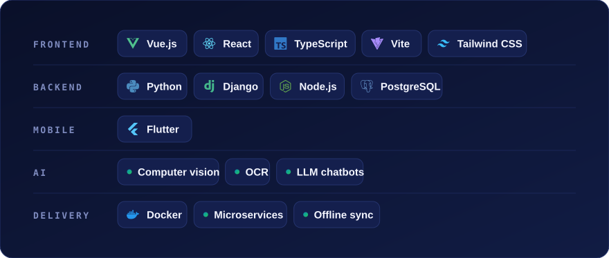

<a href="https://q-tech-solutions.com/">
  <picture>
    <source media="(prefers-color-scheme: dark)" srcset="assets/banner-dark.svg" />
    <source media="(prefers-color-scheme: light)" srcset="assets/banner-light.svg" />
    
  </picture>
</a>

  <a href="https://q-tech-solutions.com/"><b>q-tech-solutions.com</b></a> &nbsp;·&nbsp;
  <a href="https://www.linkedin.com/company/qtech1-solutions">LinkedIn</a> &nbsp;·&nbsp;
  <a href="https://www.facebook.com/share/1DYTj8kWT8/">Facebook</a> &nbsp;·&nbsp;
  <a href="https://www.instagram.com/qtechsolutions.eg">Instagram</a> &nbsp;·&nbsp;
  <a href="mailto:info@q-tech-solutions.com">info@q-tech-solutions.com</a>

 

Most businesses that come to us have already tried the usual routes. Freelancers who disappear
halfway through. Agencies where the senior people sell and juniors deliver. In-house hiring that
takes months before a line of code is written.

**Q-Tech is the alternative: one small, accountable team that designs, builds and keeps running
the systems a business depends on.** We work in short sprints, give a clear timeline before we
start, and stay on after launch for maintenance and updates.

<table>
  <tr>
    <td width="33%" align="center"><h3>15+</h3>projects delivered</td>
    <td width="33%" align="center"><h3>15+</h3>clients</td>
    <td width="33%" align="center"><h3>3+</h3>years building</td>
  </tr>
</table>

## Products

Ready-to-deploy systems, built for the Egyptian and Arabic-speaking market.

<table>
  <tr>
    <td width="33%" valign="top">
      <b>POS &amp; Store Management</b> 
      Retail · Supermarkets
      
Arabic point-of-sale and back office: barcode checkout, inventory, customer credit, supplier
      purchasing, payroll and reports. Cloud and fully offline desktop editions.

      <a href="https://q-shop-cashier.deplois.net/">Live demo&nbsp;→</a>
    </td>
    <td width="33%" valign="top">
      <b>PharmaSyst</b> 
      Healthcare · Pharmacies
      
Pharmacy management that replaces spreadsheets and paper invoices: stock, sales, accounting
      and expiry-date tracking in a single system.

      <a href="https://qtechpharmasyst.deplois.net">Live demo&nbsp;→</a>
    </td>
    <td width="33%" valign="top">
      <b>HR System</b> 
      Operations · Any team size
      
Attendance, payroll, leave and overtime in one place. Rebuilt from a Django monolith into
      independent microservices.

      <a href="https://hrs.deplois.net/">Live demo&nbsp;→</a>
    </td>
  </tr>
</table>

## Selected work

| Project | What we built | |
|---|---|---|
| **Real Estate ERP & CRM** | End-to-end platform for property developers, from first lead to unit sale and installment collection. Vue, Django, PostgreSQL, Docker. | [View](https://real.deplois.net/) |
| **Restaurant ordering platform** | Online menu, checkout, combo deals and promo codes, table reservations and an owner dashboard. | [View](https://foodshop.q-tech-solutions.com/) |
| **Laapak** | E-commerce store with product management, cart, payment integration and admin panel. | [View](http://laapak.com/) |
| **Muscle Recovery Center** | Marketing site for a physical recovery clinic. | [View](https://muscle-recovery-center.com) |
| **Leaflet Analysis** | Computer-vision pipeline that segments retail leaflets and extracts product names and prices with OCR. | |
| **Store assistant** | AI chatbot for an online store that handles product search and recommendations. | |

More case studies on [q-tech-solutions.com/projects](https://q-tech-solutions.com/projects).

## Stack

<picture>
  <source media="(prefers-color-scheme: dark)" srcset="assets/stack-dark.svg" />
  <source media="(prefers-color-scheme: light)" srcset="assets/stack-light.svg" />
  
</picture>

## How we work

1. **Discovery call.** We learn how your business actually runs before proposing anything.
2. **Scope and timeline.** A written plan with a clear timeline: weeks for smaller builds, a few months for full systems.
3. **Build in sprints.** Short cycles with working software you can review along the way.
4. **Launch and support.** Deployment and ongoing maintenance after go-live.

## Team

Led by **Muhammed Gamal Eldin** (CEO), **Yousif Ammar** (COO) and
**[MohaMed NabiL](https://www.linkedin.com/in/mohamed-nabil-1458872b2/)** (CTO), with engineers, designers,
consultants and a marketing team. [Meet everyone →](https://q-tech-solutions.com/team)

## Start a project

Tell us what you need at [info@q-tech-solutions.com](mailto:info@q-tech-solutions.com) or
+20&nbsp;151&nbsp;567&nbsp;5203, and we will set up a call.
